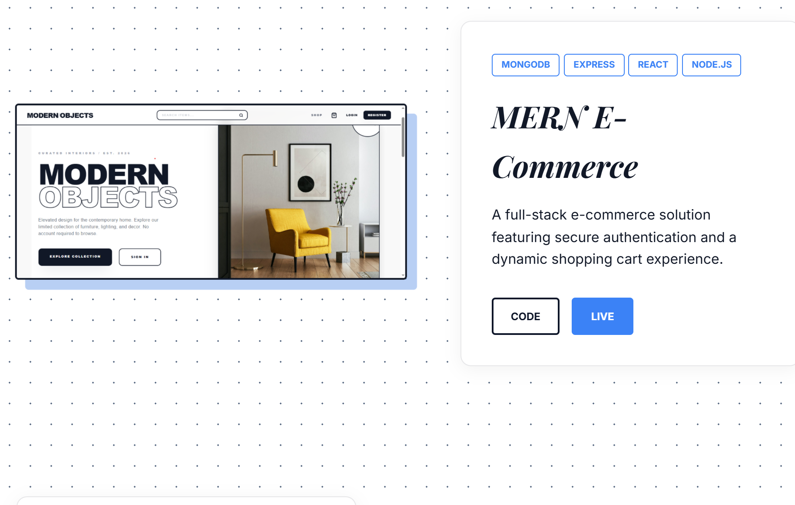
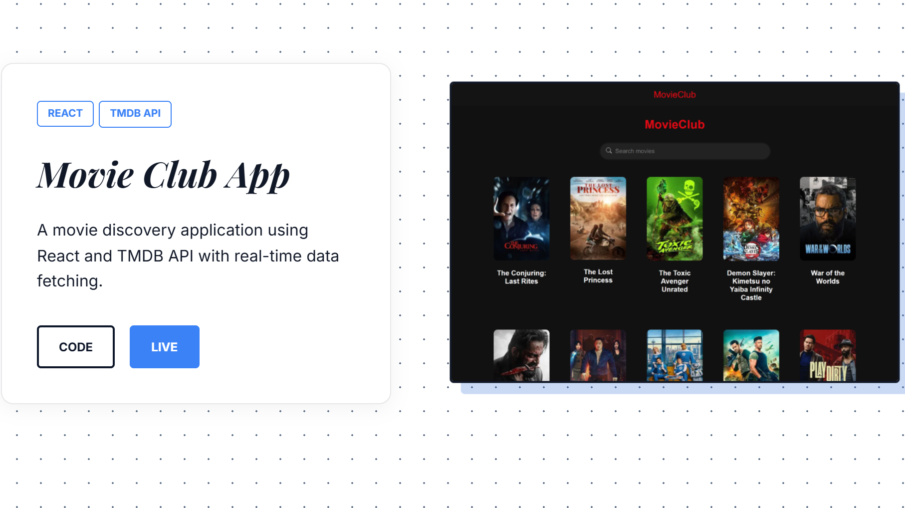
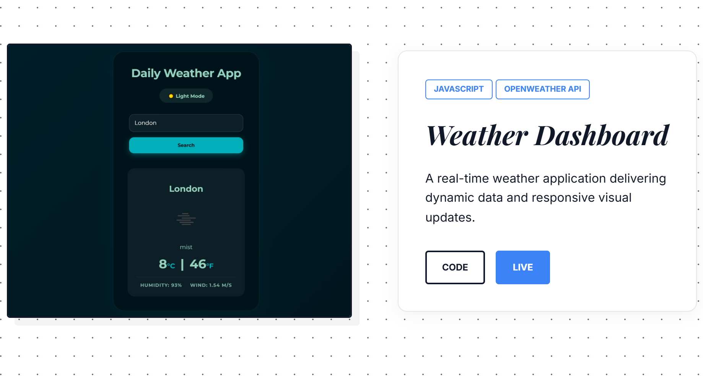

# Portfolio | Alda Kosta

A modern, responsive portfolio website built with HTML5, CSS3, and JavaScript.

## 📸 Project Previews

  
  
  

## 🛠️ Built With

- **Frontend:** HTML5, CSS3, JavaScript (ES6+)
- **Stack:** MERN (React, Node.js, Express, MongoDB), PostgreSQL
- **Tools:** Git, Postman, Figma

## 📂 Features

- Responsive Design (Desktop/Mobile)
- Interactive Project Showcase
- Reveal-on-scroll animations
